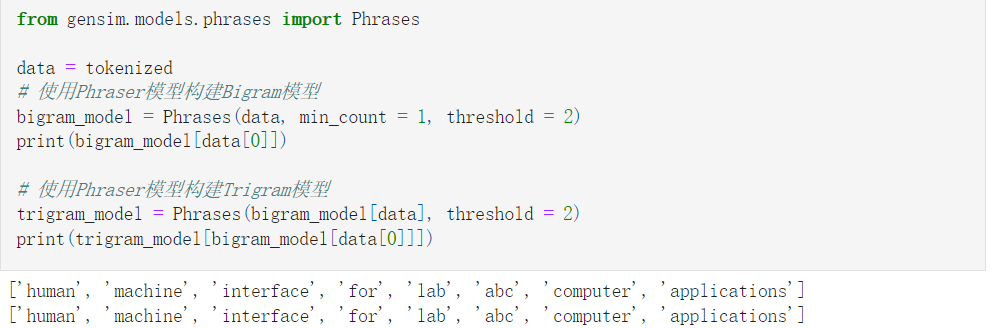
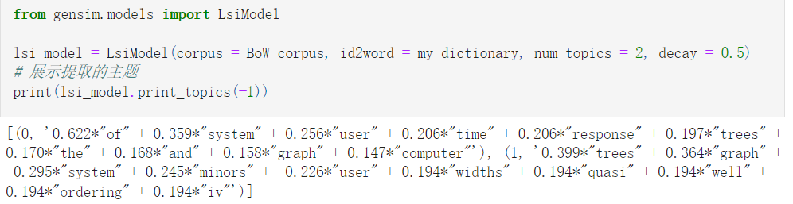

# Gensim调研报告

## 任务要求

本仓库对于Gensim的分析基于翻译技术与实践课程中的作业，作业的要求如下：

基础任务：知道它是啥，能做什么

进阶任务：了解其所有可能的用途，跑通部分测试用例

## Gensim介绍

Gensim是一款开源的第三方Python工具包，用于从原始的非结构化的文本中，无监督地学习到文本隐层的主题向量表达。  

它支持包括TF-IDF，LSA，LDA，和word2vec在内的多种无监督的主题模型算法，支持流式训练，并提供了诸如相似度计算，信息检索等一些常用任务的API接口

本项目对gensim库的各个功能进行介绍和简单的使用

参考资料：
+ https://www.geeksforgeeks.org/nlp-gensim-tutorial-complete-guide-for-beginners/
+ Gensim中文文档 https://gensim.apachecn.org/#/
+ Gensim官方文档 https://radimrehurek.com/gensim/auto_examples/index.html#documentation
+ 15分钟入门Gensim https://zhuanlan.zhihu.com/p/37175253

## Gensim功能

Gensim的主要功能有：
+ **内存独立性**：任何时候都不需要整个训练语料库完全存放在内存中，因此可以处理大型的Web级语料库
+ **内存共享**：经过训练的模型可以持久保存并通过mmap加载，多个进程可以共享数据从而减少内存占用
+ **向量空间算法的高效实现**：包括Word2Vec、Doc2Vec、FastText、Tf-Idf、潜在语义分析（LSI，LSA）、隐含狄利克雷分布（LDA）和随机投影（RP）
+ 对主流数据格式的I/O包装和读写
+ 通过语义表示对文档进行相似性查询

## Gensim的核心概念

### 语料Corpus

文本文档的集合

Corpus在Gensim中有两种作用
1. 作为模型训练的输入，模型通过训练语料查找文档的主题，初始化模型的参数
2. 根据训练后的主题模型从文档中提取主题，通过语义相似性、聚类等方式索引语料库

### 向量Vector

用数学方式表达文档，将文档转换为一串数字  

比如：可以用词袋模型将文档表示为向量，每个向量包含字典中每个单词在该文档中的频率

通常情况下，向量中包含很多零值，为了减少内存占用，Gensim可以省略向量中所有值为0的元素，用稀疏向量（Sparse Vector）的格式表示文档。  
如：(0.0, 2.0, 5.0) -> [(2, 2.0), (3, 5.0)]

### 模型 Model

模型指将文档从一种表示形式转换到另一种文档表示。在Gensim中文档通过向量表示，模型可以被认为是将向量从一种表示形式转换为另一种表示形式的算法

Gensim实现了Word2Vec、LsiModel、LdaModel等模型

## Gensim功能展示

### 语料库和字典

Gensim中没有对于对原始文本进行预处理的方式和接口进行强制约束，可以使用不同的方法对原始文本（根据任务的需求）进行预处理：分词、处理停用词、词干提取、大小写转换等等。

Gensim本身提供了simple_preprocess方法进行预处理，方法会对文本进行分词和标准化之后返回token序列

对于经过预处理的文档，Gensim可以通过Dictionary类根据语料构建字典，字典对语料中每个单词赋予一个整数索引，根据这个索引可以使用Dictionary的方法将句子转换为词袋模型的向量

Gensim提供了不同的方法存储和读取字典，支持通过Matrix Market格式保存和读取语料库

### Gensim中使用TF-IDF模型

TF-IDF — Term Frequency(词频)-Inverse Document Frequency(逆文档频率)，是一种用于信息检索和数据挖掘的加权技术。

字词的重要性与它在文件中出现的次数成正比增加，但同时会随着在语料库中出现的频率成反比下降。

TF-IDF的主要思想是，如果某个词在文档中出现的频率高，在其他文档中很少出现，认为这个词具有很好的类别区分能力，适合用来分类。
+ 优点：实现简单高效
+ 缺点：不能有效反映词的重要程度，没有考虑到特征词的分布情况(特征词的位置，在不同类别文档中的分布)，

参考资料：https://blog.csdn.net/asialee_bird/article/details/81486700

### Gensim中N-gram模型使用

Gensim中支持N-gram模型，通过gensim.models.phrases模块

### Gensim中Word2Vec模型使用

Word2Vec是一种Word Embedding方法，将不可计算、非结构化的词转化为可计算、结构化的向量，即将词转换为词向量。

Word2Vec模型基于词袋模型和Skip-gram模型，使用双层神经网络用来训练来重新构建词向量。

参考资料：https://zhuanlan.zhihu.com/p/26306795

Word2Vec将词转换为词向量（包含其语义表示），可以通过向量的相似度表示词之间的相似度

### Gensim中Doc2Vec的使用

Doc2vec方法是一种无监督算法，能从变长的文本（例如：句子、段落或文档）中学习得到固定长度的特征表示，用一个向量表示不同的文档，潜在地克服词袋模型的缺点。

参考资料：https://zhuanlan.zhihu.com/p/136096645

### Gensim中LDA的使用

LDA - Latent Dirichlet Allocation，用来推测文档的主题分布。它可以将文档集中每篇文档的主题以概率分布的形式给出，从而通过分析一些文档抽取出它们的主题分布后，便可以根据主题分布进行主题聚类或文本分类。

LDA是一种无监督学习，基于词袋模型，它认为文档是一组词构成的集合，词与词之间是无序的。一篇文档可以包含多个主题，文档中的每个词都是由某个主题生成的，LDA给出文档属于每个主题的概率分布，同时给出每个主题上词的概率分布。

参考资料：
+ https://zhuanlan.zhihu.com/p/31470216
+ https://blog.csdn.net/guleileo/article/details/80971601

LDA模型主要提供3个方面的信息:
+ 文档中的主题
+ 每个词属于什么主题
+ φ值

### Gensim中使用LSI模型

隐性语义索引 LSI — Latent Semantic Indexing，是一种简单实用的主题模型。它是一种利用奇异值分解(SVD)方法获得在文本中术语和概念之间关系的索引和获取方法。该方法的主要依据是在相同文章中的词语一般有类似的含义,可以从一篇文章中提取术语关系，从而建立起主要概念内容。

参考资料
+ https://www.cnblogs.com/pinard/p/6805861.html
+ https://blog.csdn.net/guoziqing506/article/details/81007364

### Gensim中相似性度量

将词或者文档转换为向量表示后，可以通过向量度量其相似性,将文档放在模型中计算其文档向量，之后使用相似度计算对象计算相似度。

Gensim中主要有两种度量方式
+ 余弦相似度：用两个非零向量的夹角的余弦值度量相似度
+ 软余弦相似度：与余弦相似度类似，但是软余弦相似度会考虑到向量空间模型中特征的相似度

默认使用余弦相似度

